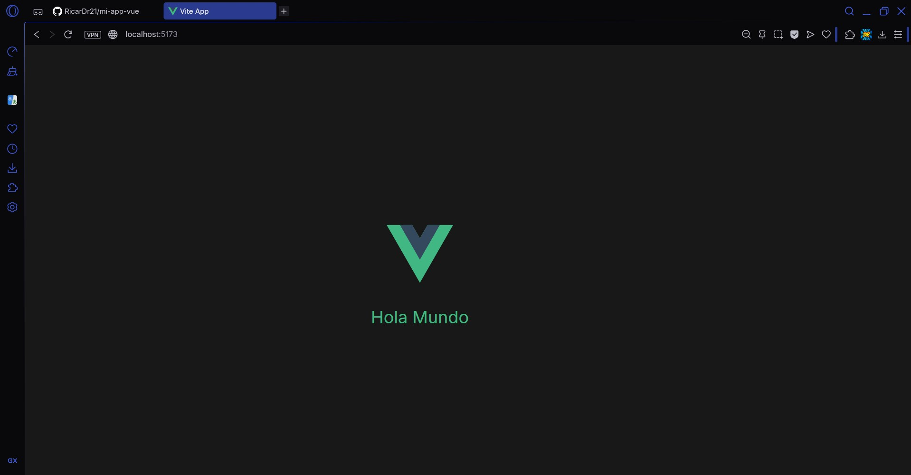

# Mi proyecto de práctica

Stack elegido: Vue (frontend) + Express (backend)

Motivo de la elección (según los 4 criterios vistos en clase):
- Lenguaje: JavaScript/TypeScript en ambos, lo que simplifica trabajar con un solo lenguaje en todo el stack.
- Curva de aprendizaje: baja en los dos casos, sintaxis clara y poca configuración inicial.
- Facilidad de instalación: Vue se genera con npm create vue@latest y Express con npm install express, ambos listos en segundos.
- Comunidad y documentación: los dos tienen documentación oficial completa y comunidades activas.

## Cómo correr el proyecto

### Frontend (Vue)
npm install
npm run dev
Abre http://localhost:5173

### Backend (Express)
cd backend-express
npm install
node index.js
Abre http://localhost:3000
## Captura del proyecto funcionando

